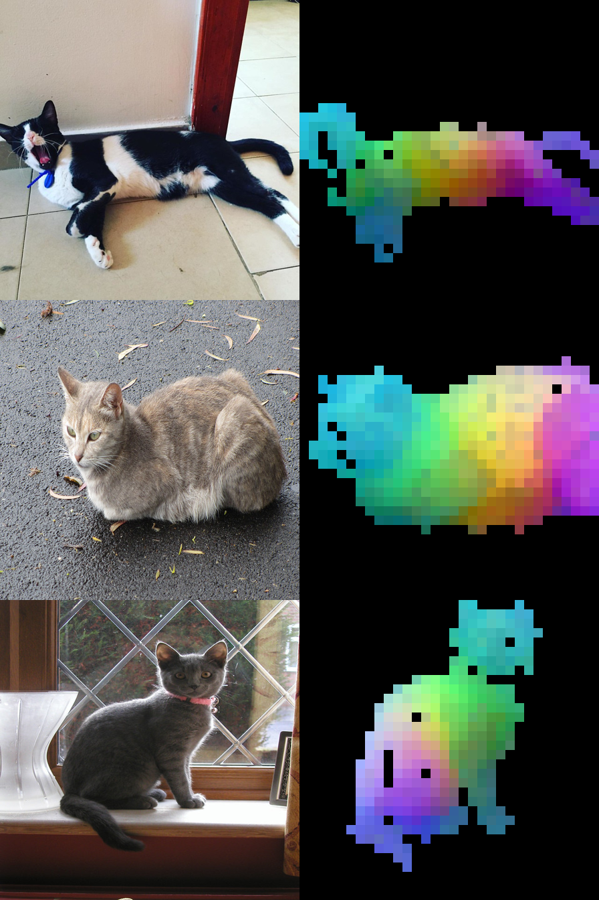

# dino-pca-visualizer

A web service that visualizes DINOv2 image features using PCA, based on the technique described in [DINOv2 PCA Visualization](https://junukcha.github.io/code/2023/12/31/dinov2-pca-visualization/).

## Overview

Upload an image and get a colorful visualization of its semantic structure. Regions with similar visual semantics (e.g., the head, legs, and body of an animal) are shown in similar colors, while the background is masked out in black.



## How it works

DINOv2 divides the input image into 14×14 pixel patches and produces a feature vector for each patch. These patch tokens are then visualized via two-stage PCA:

1. **Background removal** — PCA with 1 component is applied to all patch tokens. The first component is min-max normalized, and a threshold (0.6) is used to separate foreground from background. Because PCA has sign ambiguity, the direction is automatically determined by inspecting the four corner patches of the image (top-left, top-right, bottom-left, bottom-right), which are almost always background: if more than half of those four patches score above the threshold, the component direction is considered inverted and the mask condition is flipped.
2. **RGB visualization** — PCA with 3 components is applied to the foreground patches only. Fitting on foreground patches alone ensures that the components capture semantic differences *within* the object, rather than being dominated by the foreground/background split. The 3 components are mapped to R, G, and B channels respectively.

## Prerequisites

- Python 3.10+
- Internet access on first run (downloads the `dinov2_vits14` model weights, ~100 MB)

## Installation

```bash
python -m venv .venv
source .venv/bin/activate
pip install -r requirements.txt
```

## Usage

```bash
uvicorn app.main:app --reload
```

Open [http://localhost:8000](http://localhost:8000) in your browser, upload an image, and click **Visualize**.

## Reference

- [DINOv2 PCA Visualization](https://junukcha.github.io/code/2023/12/31/dinov2-pca-visualization/) by JunukCha
- [facebookresearch/dinov2](https://github.com/facebookresearch/dinov2)
